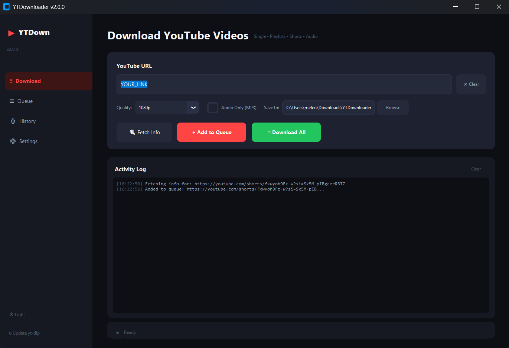
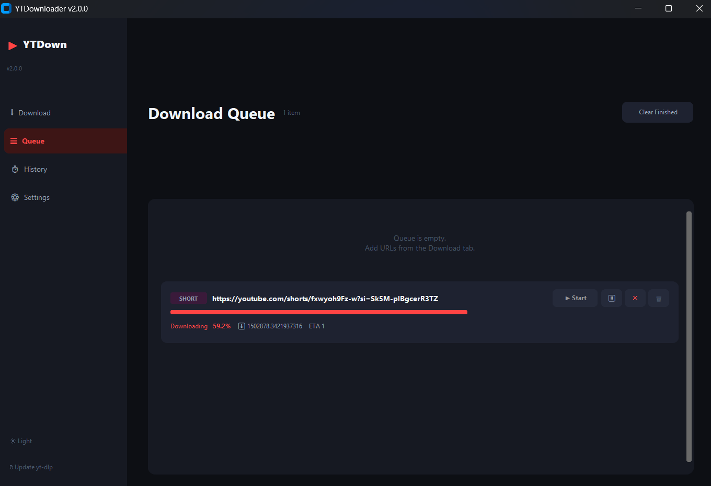
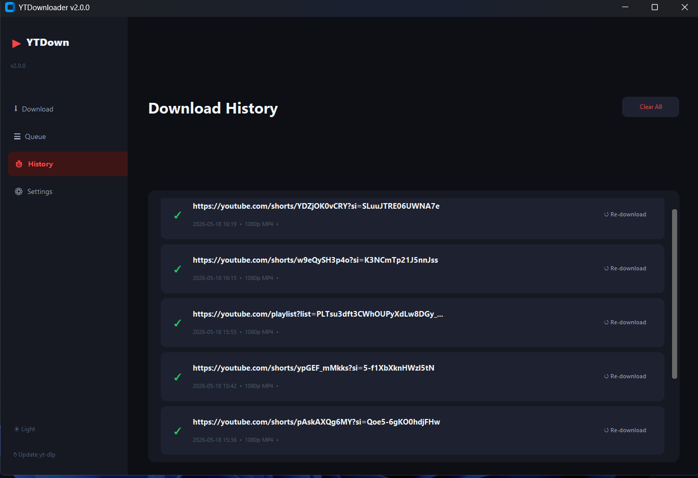
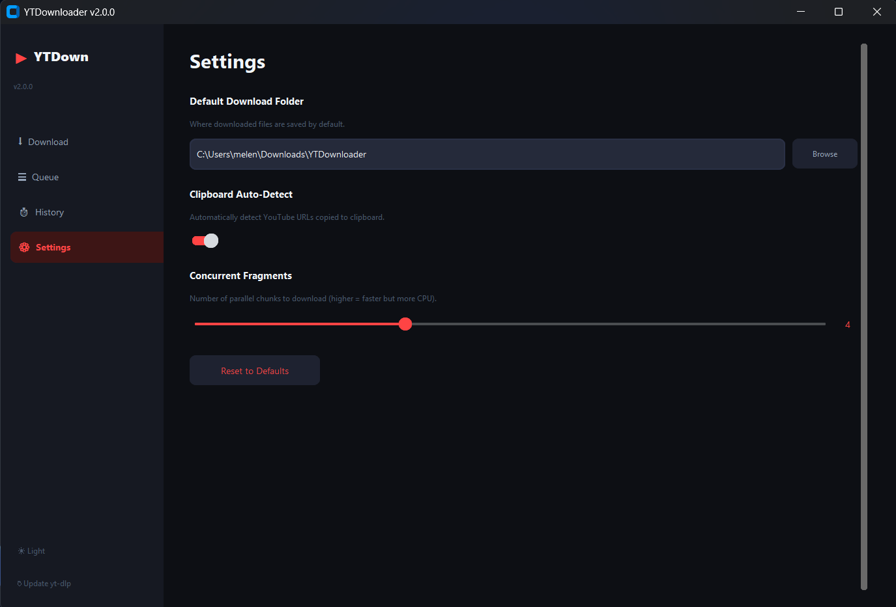

# 🎬 YTDownloader Pro

A modern, professional, and feature-rich YouTube Downloader desktop application built with Python.  
Download videos, playlists, Shorts, and audio in high quality with a smooth desktop experience powered by `yt-dlp`, `FFmpeg`, and `CustomTkinter`.

---

# ✨ Features

✅ Download single YouTube videos  
✅ Download complete playlists  
✅ Download YouTube Shorts  
✅ Audio-only mode (MP3)  
✅ High-quality downloads up to 4K  
✅ Automatic audio + video merging using FFmpeg  
✅ Modern desktop UI with CustomTkinter  
✅ Download queue management  
✅ Pause / Resume / Cancel downloads  
✅ Progress bar with speed & ETA  
✅ Thumbnail preview support  
✅ Clipboard auto-detection for YouTube URLs  
✅ Drag & Drop URL support  
✅ Persistent download history  
✅ Settings page  
✅ Dark / Light mode toggle  
✅ One-click yt-dlp updater  
✅ Retry support for network issues  
✅ Multi-threaded architecture (UI never freezes)  
✅ Exported as standalone `.exe` application  
✅ FFmpeg bundled support  
✅ Clean and scalable project structure  

---

# 📸 Application Preview

## 🎥 Download Page



---

## 📥 Download Queue



---

## 🕘 History Page



---

## ⚙️ Settings Page



---

# 🛠️ Technologies Used

- Python 3.11
- yt-dlp
- FFmpeg
- CustomTkinter
- Pillow
- tkinterdnd2
- PyInstaller

---

# 📂 Project Structure

```bash
YTDownloader/
├── main.py
├── requirements.txt
├── ytdownloader.spec
├── assets/
│   └── icon.ico
├── ffmpeg/
│   ├── ffmpeg.exe
│   └── ffprobe.exe
├── core/
│   ├── __init__.py
│   ├── downloader.py
│   ├── history.py
│   └── settings.py
└── ui/
    ├── __init__.py
    ├── app.py
    ├── theme.py
    ├── widgets.py
    └── dialogs.py
```

---

# ⚙️ Installation Guide

## 1️⃣ Clone the Repository

```bash
git clone https://github.com/mo-elanany1/python-devops-youtube-downloader.git
```

---

## 2️⃣ Navigate to the Project Folder

```bash
cd python-devops-youtube-downloader
```

---

## 3️⃣ Install Python Dependencies

```bash
pip install -r requirements.txt
```

Or manually:

```bash
pip install yt-dlp
pip install customtkinter
pip install pillow
pip install tkinterdnd2
pip install pyinstaller
```

---

# 🎞️ Install FFmpeg

## Option A — Automatic Installation

```powershell
winget install Gyan.FFmpeg
```

Restart your terminal after installation.

---

## Option B — Manual Installation

1. Download FFmpeg from:

https://ffmpeg.org/download.html

2. Extract the files.

3. Copy:

- `ffmpeg.exe`
- `ffprobe.exe`

Into:

```bash
ffmpeg/
```

---

# ▶️ Run the Application

```bash
python main.py
```

---

# 🖥️ Build Standalone EXE

## Using PyInstaller Spec File

```bash
pyinstaller ytdownloader.spec
```

---

## Or Build Directly from Command

```bash
pyinstaller main.py ^
  --onefile ^
  --windowed ^
  --name YTDownloader ^
  --hidden-import customtkinter ^
  --hidden-import yt_dlp ^
  --hidden-import PIL ^
  --collect-all customtkinter ^
  --collect-all yt_dlp ^
  --noconfirm
```

---

# 📦 Output Location

```bash
dist/
└── YTDownloader.exe
```

Standalone executable — no Python installation required.

---

# 🎨 Add Custom Icon

1. Add your icon file:

```bash
assets/icon.ico
```

2. Rebuild the project.

---

# 📥 Bundle FFmpeg into EXE

Place:

- `ffmpeg.exe`
- `ffprobe.exe`

Inside:

```bash
ffmpeg/
```

Then add this inside `ytdownloader.spec`:

```python
binaries=[
    ('ffmpeg/ffmpeg.exe',  'ffmpeg'),
    ('ffmpeg/ffprobe.exe', 'ffmpeg'),
],
```

Rebuild the project afterward.

---

# 🔄 Update yt-dlp

Inside the app click:

```text
↻ Update yt-dlp
```

Or manually:

```bash
pip install --upgrade yt-dlp
```

---

# 🛠️ Troubleshooting

| Problem | Solution |
|---|---|
| ffmpeg not found | Install FFmpeg or place binaries in `ffmpeg/` folder |
| ModuleNotFoundError | Install missing dependency using pip |
| EXE opens slowly | Normal behavior for PyInstaller one-file mode |
| Download stuck at 0% | Check internet connection or URL |
| Age-restricted video error | yt-dlp limitation |
| Antivirus flags EXE | Common false positive for PyInstaller apps |

---

# 💾 Data Locations

| Data | Location |
|---|---|
| Download History | `%USERPROFILE%\.ytdownloader\history.json` |
| Settings | `%USERPROFILE%\.ytdownloader\settings.json` |
| Downloads | `%USERPROFILE%\Downloads\YTDownloader\` |

---

# 🚀 Future Improvements

- Multi-language support
- Built-in video player
- Download scheduler
- Auto-update system
- Subtitle downloader
- GPU accelerated processing
- Batch link import
- Cloud sync

---

# 👨‍💻 Developer

## Mohamed Elenany
### Data Analyst | Business Intelligence Enthusiast

Passionate about building modern desktop applications, automation tools, and data-driven solutions using Python.

---

## ☕ Stay Connected

<div align="center">

[](https://www.linkedin.com/in/M0hamed-Elanany1)
[](https://moelenany.netlify.app)
[](melenany606@email.com)
[](https://github.com/mo-elanany1)

</div>

# ⭐ Support

If you like this project, give it a star on GitHub ⭐

---

# 📜 License

This project is licensed under the MIT License.
